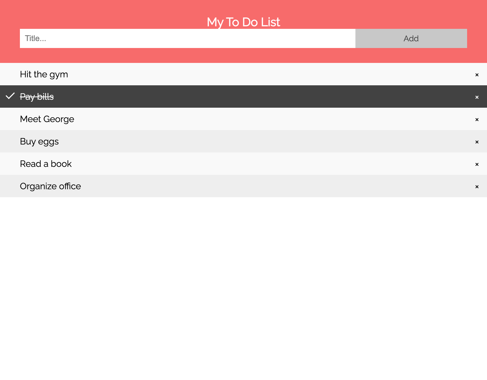

# Workshop WCS

La [WildCodeSchool](https://www.wildcodeschool.com/fr-FR) est une école de code gratuite, où vous pouvez apprendre à créer des applications web et mobile.

Nous disposons de plusieurs formations.

-   [Développeur Web](https://www.wildcodeschool.com/fr-FR/formations/developpeur-web)
-   [Infrastructure et cybersécurité](https://www.wildcodeschool.com/fr-FR/formations/formation-technicien-systemes-et-reseaux-alternance)
-   [Formation web designer
    ](https://www.wildcodeschool.com/fr-FR/formations/formation-web-designer)
-   [Data analyst](https://www.wildcodeschool.com/fr-FR/formations/data-analyst)
-   [Formation no-code](https://www.wildcodeschool.com/fr-FR/formations/formation-developpeur-no-code)

## Introduction

Nous allons voir lors de ce workshop comment créer un site web avec la trinité
:

-   HTML
-   CSS
-   JavaScript

Nous allons coder une application `todo app`

## HTML

Tout d'abord, nous allons voir comment créer un site web avec du HTML.

C'est quoi une balise, un élément HTML ? Un attribut ?

## CSS

Il y a tellement de choses à dire sur le CSS ! Il s'agit de la mise en forme du site web.

Je vous invite à faire vos premières recherches sur le CSS.

## JavaScript

Nous allons nous intéresser sur le JavaScript.

## Plus d'information

Ne pas hésiter à visiter ma chaîne YouTube et le repositoty associer 😁

Repository: [anthony gorski](https://github.com/GorskiAnthony/youtube)

Détail ici : [page notion](https://anthony-gorski.notion.site/Workshop-HTML-CSS-JS-2af4a89872ba4cdc9e7dee5db4e4fddc)
